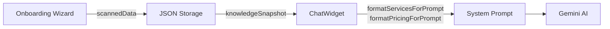

# Knowledge Base Structure — Onboarding Guide

This document defines the data structure required for optimal ChatWidget performance.

---

## 📊 Data Flow: Onboarding → AI



| Stage | Function | What Happens |
|-------|----------|--------------|
| **Train Button** | `onComplete(scannedData)` | Passes reviewed data to parent |
| **Storage** | `syncKnowledgeBase()` | Saves as JSON to Supabase |
| **ChatWidget Init** | `knowledgeSnapshot = JSON.parse(...)` | Parses stored KB |
| **Prompt Build** | `formatServicesForPrompt()` | Converts services to readable text |
| **Prompt Build** | `formatPricingForPrompt()` | Converts pricing plans to text |
| **AI Ingestion** | System prompt injection | AI reads structured text |

### Format Functions (ChatWidget.tsx)

```typescript
// Services → "Haircut ($45, 30 min) — Basic haircut | Color ($120+, 60 min)"
formatServicesForPrompt(services)

// Pricing → "Basic: $49/mo — 24/7 Chat, 1 Seat | Pro: $79/mo — Analytics"
formatPricingForPrompt(pricing)
```

> [!IMPORTANT]
> The AI reads **text strings**, not raw JSON. Format functions must produce clear, readable output.

---

## 📝 KB Edit Flow (Post-Onboarding)

When users edit KB after onboarding, changes propagate:

```
KnowledgeData.tsx → setKnowledgeData() → DataContext → syncKnowledgeBase() → Supabase → ChatWidget re-init
```

### Key Points

1. **Save triggers sync**: `setKnowledgeData({ ...data, lastUpdated: new Date() })`
2. **DB updates automatically**: DataContext's `useEffect` syncs to Supabase
3. **AI reads on next chat**: ChatWidget parses fresh `knowledgeSummary` on `initChat()`

### Adding New KB Fields

| Step | File | Action |
|------|------|--------|
| 1 | `types.ts` | Add to `KnowledgeBaseData` interface |
| 2 | `KnowledgeData.tsx` | Add edit UI component |
| 3 | `ChatWidget.tsx` | Add to `structuredInfo` string (lines 747-756) |
| 4 | (optional) | Create format function if complex data |

---

## 🔧 Corrections Flow (Quality Check → AI)

When users correct AI responses in the Quality Check page:

```
ReviewQueue.tsx → handleSaveCorrection() → knowledgeData.corrections[] → ChatWidget → correctionsInfo → System Prompt
```

### How It Works

1. **User submits correction** in Review Queue (lines 51-86)
2. **Saved to KB**: `setKnowledgeData({ ...data, corrections: [...corrections, newCorrection] })`
3. **ChatWidget reads** corrections on init (lines 758-762)
4. **Injected as override rules**:

```typescript
// ChatWidget.tsx lines 758-762
if (parsed.corrections && parsed.corrections.length > 0) {
  correctionsInfo = `
    CRITICAL INSTRUCTIONS (OVERRIDE PREVIOUS RULES):
    The user has previously corrected your behavior on specific queries. You MUST follow these corrections:
    ${parsed.corrections.map(c => `- When asked "${c.query}", YOU MUST ANSWER: "${c.correction}"`).join('\n')}
  `;
}
```

### Correction Schema

```typescript
corrections: [
  { query: "Do you do botox?", correction: "We specialize in non-invasive treatments only." },
  { query: "What's your cheapest service?", correction: "Our express facial is $75." }
]
```

> [!TIP]
> Corrections take precedence over general KB info because they're injected as "CRITICAL INSTRUCTIONS" at the top of the prompt.

---

## 🎯 Critical Fields (Must Collect)

| Field | Type | Example | Impact if Missing |
|-------|------|---------|-------------------|
| `companyName` | string | "Glow Skin Clinic" | ❌ Widget can't personalize |
| `businessCategory` | string | "Medical Spa" | ❌ Poor intent matching |
| `summary` | string | "Premier skin care clinic..." | ❌ Vague responses |
| `services` | Service[] | See below | ❌ Can't recommend services |
| `businessHoursByDay` | object | `{Mon: "9AM-5PM", Tue: "9AM-5PM"}` | ❌ Callback validation fails |

---

## 📋 Full Schema

### Core Business Info
```typescript
companyName: string      // "Glow Skin Clinic"
website: string          // "https://glowskin.com"  
phoneNumber: string      // "(416) 555-1234"
businessCategory: string // "Medical Spa", "Dental Clinic", "Hair Salon"
summary: string          // 2-3 sentence business description
```

### Services (Structured)
```typescript
services: [
  {
    id: "svc-001",
    name: "Facial Treatment",
    description: "Deep cleansing facial with extractions",
    duration: 60,           // minutes
    category: "Skincare",
    pricing: {
      type: "fixed",        // fixed | starting_from | hourly | contact
      amount: 150,
      currency: "USD"
    }
  }
]
```

> [!IMPORTANT]
> Services MUST have structured pricing for accurate recommendations.

### Pricing Models (Business Varies)

> [!IMPORTANT]
> Different businesses have different pricing structures. The system must support ALL of these:

| Business Type | Pricing Model | Example |
|---------------|---------------|---------|
| SaaS | Subscription plans | Basic $49/mo, Pro $99/mo |
| Salon/Spa | Service-based | Haircut $45, Color $120+ |
| Consulting | Hourly/Project | $150/hr, Project from $2,500 |
| Retail | Product pricing | Widget $29.99, Bundle $79.99 |
| Contractor | Fixed + Variable | Consultation $100, Install from $500 |

#### Structured Format (Preferred)
```typescript
pricing: [
  {
    name: "Basic Plan",           // or "Haircut" or "Consultation"
    price: "$49/mo",              // display string
    type: "subscription",         // fixed | hourly | per_session | per_project | subscription | contact
    features: ["24/7 Chat", "1 Seat"]  // optional for plans
  }
]
```

#### Pricing Types Supported
```typescript
type PricingType = 
  | 'fixed'           // One-time fixed price
  | 'starting_from'   // "From $X" - variable
  | 'hourly'          // Per hour
  | 'per_session'     // Spa, therapy
  | 'per_project'     // Consulting, contractors
  | 'per_day'         // Rentals
  | 'per_week'        // Weekly services
  | 'per_month'       // Subscriptions
  | 'subscription'    // Same as per_month
  | 'per_unit'        // Per item/quantity
  | 'custom'          // Custom text (e.g., "Varies by project")
  | 'contact';        // "Contact for pricing"
```

#### Onboarding Questions for Pricing
During onboarding, ask:
1. **"How do you charge customers?"** → Determines pricing type
2. **"Do you have packages or tiers?"** → Subscription plans vs one-off
3. **"Is pricing fixed or variable?"** → fixed vs starting_from vs custom

### Business Hours
```typescript
businessHours: "Mon-Fri: 9AM-5PM, Sat: 10AM-2PM, Sun: Closed"

// RECOMMENDED: Structured format for validation
businessHoursByDay: {
  "Mon": "9AM - 5PM",
  "Tue": "9AM - 5PM",
  "Wed": "9AM - 5PM",
  "Thu": "9AM - 5PM",
  "Fri": "9AM - 5PM",
  "Sat": "10AM - 2PM",
  "Sun": "Closed"
}
```

### Locations (Multi-Location)
```typescript
locations: [
  {
    name: "Downtown",
    address: "123 Main St",
    city: "Toronto",
    state: "ON",
    zip: "M5V 1A1",
    phone: "(416) 555-1234"
  }
]
```

### Policies
```typescript
policies: "Cancellation: 24 hours notice required. Late fee: $25 for no-shows."
```

### Top Rules (Priority Instructions)
```typescript
topRules: `
Always recommend our signature facial for first-time customers
Never discuss competitor pricing
If budget is under $100, recommend Basic package
`
```

### Corrections (Override AI Behavior)
```typescript
corrections: [
  { query: "Do you do botox?", correction: "We specialize in non-invasive treatments only." },
  { query: "What's your cheapest service?", correction: "Our express facial is $75." }
]
```

---

## ✅ Onboarding Checklist

```markdown
- [ ] Company name and website URL
- [ ] Business category (dropdown: Spa, Clinic, Salon, Restaurant, etc.)
- [ ] 2-3 sentence summary
- [ ] Services with pricing (at least 3)
- [ ] Business hours by day
- [ ] Location(s) with address
- [ ] Contact phone/email
- [ ] Cancellation/refund policies
- [ ] Any priority rules (optional)
```

---

## 🔍 Current Onboarding vs Required Data

### What the Wizard Collects Today

| Step | Data Collected |
|------|----------------|
| **Step 1** | Website URL |
| **Step 2** | Business type (storefront/mobile/online), Locations |
| **Step 3** | Auto-scan extracts: summary, services, hours, pricing, policies |
| **Step 4** | User reviews/edits the 5 sections: Identity, Services, Operations, Pricing, Policies |
| **Step 5** | Training confirmation |

### ✅ What's Working

- ✅ Website scan auto-populates most fields
- ✅ Locations collected with address autocomplete
- ✅ Services editable with structured pricing
- ✅ User can upload documents to supplement scan

### ❌ Gaps to Fix

| Missing Data | Impact | Recommended Fix |
|--------------|--------|-----------------|
| **Business Hours by Day** | Callback validation fails (Sunday issue) | Add structured hours picker to Operations section |
| **Phone Number** | Can't call back leads | Add to Identity section |
| **Top Rules** | AI doesn't know business priorities | Add text area in Policies section |
| **Pricing Plan Structure** | "budget" → dumps all plans | Ensure scan extracts structured `PricingPlan[]` |

### 🔧 Recommended Onboarding Changes

1. **Operations Section** — Add day-by-day hours picker:
   ```
   Mon: [ 9:00 AM ] - [ 5:00 PM ] ☑️ Open
   Tue: [ 9:00 AM ] - [ 5:00 PM ] ☑️ Open
   Sun: ☐ Closed
   ```

2. **Identity Section** — Add phone number field

3. **Policies Section** — Add "Priority Instructions" text area:
   ```
   Example: 
   - Always recommend signature facial for first-timers
   - Never discuss competitor pricing
   - Budget under $100 → recommend Basic package
   ```

4. **Pricing Section** — Ensure structured format:
   ```json
   {
     "name": "Basic",
     "price": "$49/mo",
     "features": ["24/7 Chat", "1 Seat"]
   }
   ```

---

## 🔧 Data Quality Tips

1. **Pricing precision** — Include exact prices, not ranges
2. **Hours format** — Use `9AM - 5PM` not `9-5` 
3. **Service descriptions** — Include what's included, duration
4. **Policies** — Be specific about cancellation, deposits, late fees
